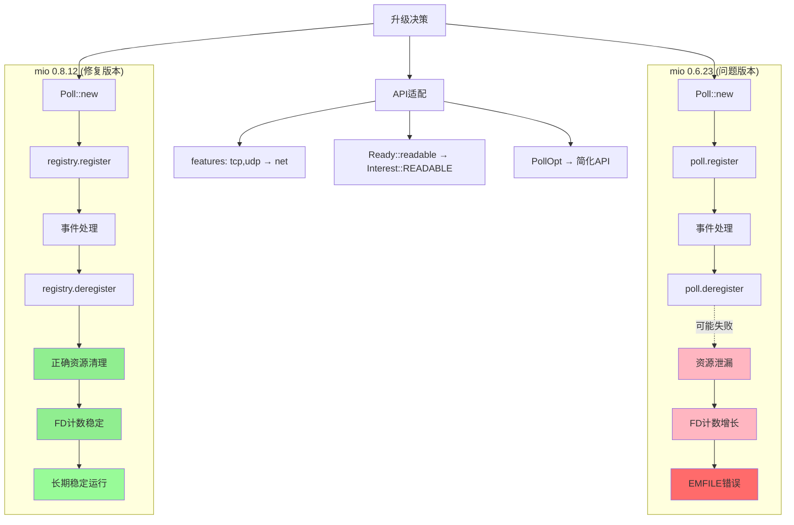

# 升级Vditor CDN加载的mermaid从8.8.0到11.12.1

## Vditor CDN Mermaid升级方案

### 方案1: 修改CDN加载路径（推荐）

修改 `vditor/src/ts/markdown/mermaidRender.ts`，将CDN路径从vscode-vditor改为直接加载mermaid 11.12.1：

```typescript
// 当前代码：
addScript(`${cdn}/dist/js/mermaid/mermaid.min.js`, "vditorMermaidScript")

// 修改为：
addScript(`https://unpkg.com/mermaid@11.12.1/dist/mermaid.min.js`, "vditorMermaidScript")
```



