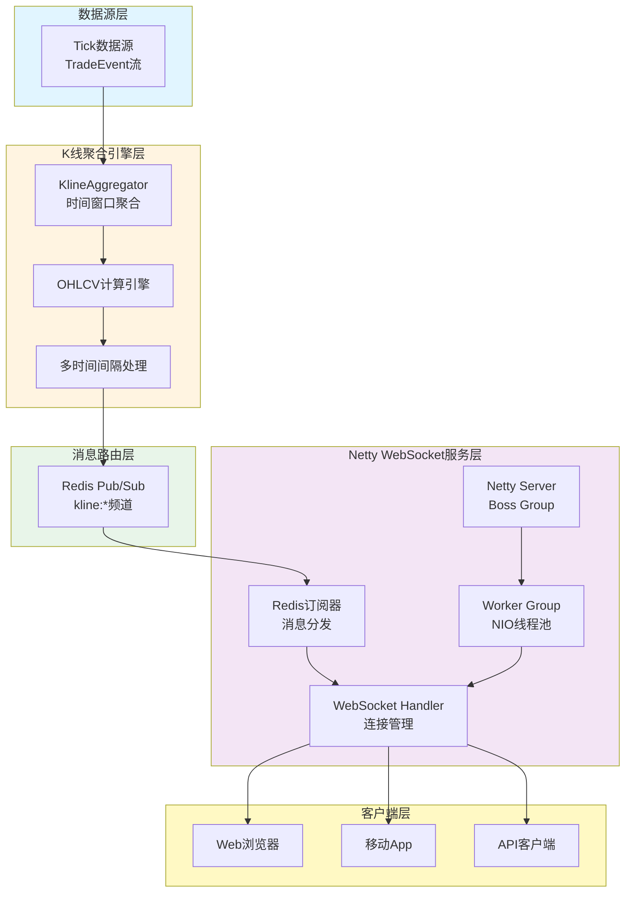

## 整体架构设计

### 架构图

```mermaid
graph TB
    subgraph DATA["数据源层"]
        TICK[Tick数据源<br/>TradeEvent流]
    end
  
    subgraph AGG["K线聚合引擎层"]
        AGG1[KlineAggregator<br/>时间窗口聚合]
        AGG2[OHLCV计算引擎]
        AGG3[多时间间隔处理]
    end
  
    subgraph MSG["消息路由层"]
        REDIS[Redis Pub/Sub<br/>kline:*频道]
    end
  
    subgraph NETTY["Netty WebSocket服务层"]
        NETTY1[Netty Server<br/>Boss Group]
        NETTY2[Worker Group<br/>NIO线程池]
        NETTY3[WebSocket Handler<br/>连接管理]
        NETTY4[Redis订阅器<br/>消息分发]
    end
  
    subgraph CLIENT["客户端层"]
        C1[Web浏览器]
        C2[移动App]
        C3[API客户端]
    end
  
    TICK --> AGG1
    AGG1 --> AGG2
    AGG2 --> AGG3
    AGG3 --> REDIS
  
    REDIS --> NETTY4
    NETTY4 --> NETTY3
    NETTY1 --> NETTY2
    NETTY2 --> NETTY3
    NETTY3 --> C1
    NETTY3 --> C2
    NETTY3 --> C3
  
    style DATA fill:#e1f5ff
    style AGG fill:#fff4e1
    style MSG fill:#e8f5e9
    style NETTY fill:#f3e5f5
    style CLIENT fill:#fff9c4
```
